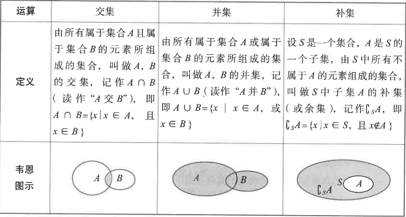

## 集合与简易逻辑

[toc]

###  一、集合

#### (一）集合的概念及表示方法

1. ###### 集合的相关概念

集合：==某些指定的对象集中在一起就成为一个集合。==构成集合的这些对象成为集合的元素。

> 不含任何元素的集合叫做空集，记作$ \phi $。
>

----

2. ###### 集合中元素的性质

- 确定性:设A是一个给定的集合,x是某一个具体的对象,则x或者是集合A的元素或者不是,两种情况必须满足一种。
- 互异性：一个给定的集合中，各个元素互不相同。
- 无序性：一个给定的集合中，元素之间不存在排列顺序的关系。

----

3. ###### 集合的表示方法

- 列举法：把集合中的元素一一列举出来，卸载大括号内。
- 描述法：把集合中的元素的公共属性特征描述出来，写在大括号内。
- 图示法

----

4. ###### 集合间的关系

- 全集:含有我们所研究的各个集合的全部元素的集合。
- 子集：对于两个集合A与B，若A中任何一个元素都是集合B的元素，则集合A是B的一个子集，记作$ A \subseteq B$。
- 真子集：对于两个集合A与B，若A是B的子集且B中至少存在一个元素不属于集合A,则称集合A是B的真子集。

> 由n个元素组成的集合，其子集的个数为2^n^个，真子集的个数为2^n^-1个。（其中减去的那个子集是是全部元素构成的。）

> 由n个元素组成的集合，其子集的个数为2

4. ###### 集合与元素之间的关系

----

5. 集合与元素间的关系

如果a是集合A的元素，就说a属于集合A，记作$ a\in A $,否则$ a \notin A$

#### (二) 集合的运算

### 二、简易逻辑

#### (一)逻辑联结词：“或（$ \or $）”“且（$ \and $）”“非（$ \neg$）”

#### (二)命题

1. ###### 命题的概念

可以判断真假的语句称为命题。

> 不含逻辑联结词的命题称为简单命题；含有的称为复合命题。

----

2. ###### 四种命题

- 原命题：若p,则q。<code>若x>3,则x>4。</code>

- 否命题：若$\neg p$,则$\neg q$。<code>若x<=3,则x<=4。</code>
- 逆命题：若q,则p。<code>若x>4,则x>3。</code>
- 逆否命题：若$\neg q$,则$\neg p$。<code>若x<=4,则x<=3。</code>

-----

3. ###### 四种命题之间的相互关系

> 原命题与其逆否命题的真假性一致。

----

#### (三)全称命题与特称命题

1. ###### 全称量词

逻辑中“对所有的”，“对任意一个”，用符号$ \forall $表示。

2. ###### 存在量词

逻辑中“存在一个”，“至少一个”，用符号$ \exists $表示。

3. ###### 全称命题

含有全称量词的命题。

4. ###### 特称命题

4. 特称命题

含有存在量词的命题。

> 全称命题的否定是特称命题，特称命题的否定是全称命题。

----

【例】（2012年下半年-初级中学-选择题）设{a~n~}为数列，对于“存在正数M，对任意正整数n，有\|a~n~\|<=M”的<code>否定</code>(即数列{a~n~}无界)是()

<code>[答案]</code>对任意正数M,存在正整数n,有\|a~n\|M

(四)充分条件与必要条件

1. 前=>后:充分条件;
2. 后=>前:必要条件;
3. 前=>后,后推不到前:充分不必要条件;
4. 后=>前,前推不到后:必要不充分条件;
5. 既不从分也不必要。

【例】（2015年上半年-高级中学-选择题$\forall a,b\in$R,"a<b"是“a^3^|a|<b^3^|b|”成立的（ ）

<code>答案</code>充分必要条件

> [解析]：1. 当a>=0,b>0时，前推得到后，后也推得到前；2.当a<=0,b>0,前推得到后，后也推得到前;3.当a<0,b<0时，前推得到后，后也推得到前。

----

